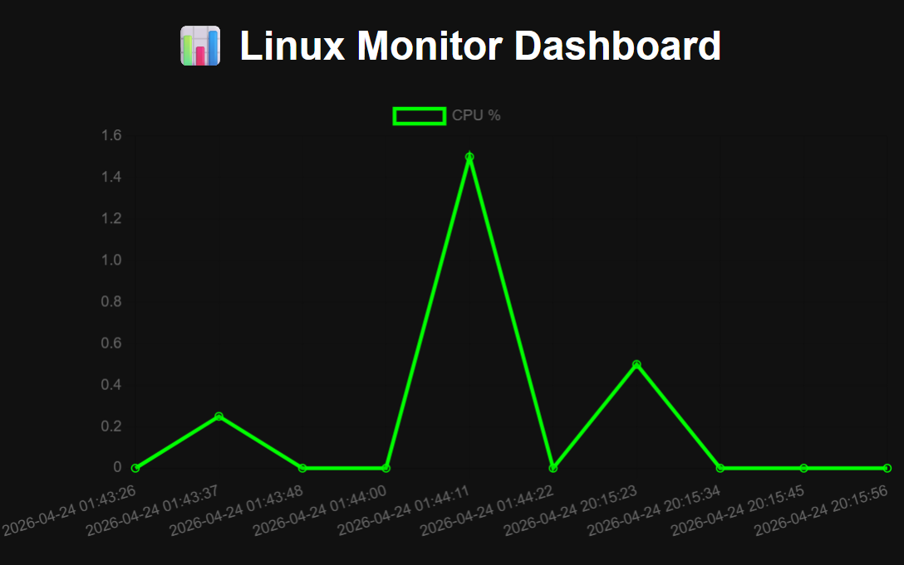

## Dashboard Preview



# Linux Monitoring System

## Overview

This project is a lightweight Linux monitoring system that collects system metrics (CPU, memory, disk), stores them in a SQLite database, and exposes the data through a REST API and a web dashboard.

It is designed to demonstrate practical skills in Linux, backend development, and service management.

---

## Architecture

The system consists of three main components:

1. **Metric Collector**

   * Reads system data from `/proc`
   * Runs continuously as a background service (systemd)
   * Stores metrics in SQLite

2. **API Service**

   * Built with Flask
   * Served using Gunicorn
   * Provides endpoints to query metrics and alerts

3. **Web Dashboard**

   * Displays recent metrics
   * Includes charts for visualization
   * Consumes the API

---

## Features

* Real-time CPU, memory, and disk monitoring
* Persistent storage using SQLite
* Background execution with systemd
* REST API for data access
* Web dashboard with charts
* Alert system with cooldown to prevent spam

---

## Tech Stack

* Python
* Flask
* SQLite
* Linux (/proc filesystem)
* systemd
* Gunicorn
* Chart.js

---

## Project Structure

```bash
linux-monitor/
│
├── monitor.py        # Metric collection script
├── app.py            # Flask API
├── templates/        # HTML dashboard
├── requirements.txt  # Python dependencies
├── README.md
└── .gitignore
```

---

## Installation

```bash
git clone https://github.com/YOUR_USERNAME/linux-monitor.git
cd linux-monitor

python3 -m venv venv
source venv/bin/activate
pip install -r requirements.txt
```

---

## Usage

### Start the monitoring script

```bash
python monitor.py
```

### Run the API (development)

```bash
python app.py
```

### Run with Gunicorn (production-style)

```bash
gunicorn -w 2 -b 0.0.0.0:5000 app:app
```

---

## API Endpoints

| Endpoint     | Description            |
| ------------ | ---------------------- |
| `/metrics`   | Last 10 system metrics |
| `/alerts`    | Last 10 alerts         |
| `/dashboard` | Web dashboard          |

---

## Dashboard

Open in your browser:

```text
http://<server-ip>:5000/dashboard
```

The dashboard displays:

* CPU usage over time
* Recent metrics in table form

---

## Alerts

Alerts are triggered when thresholds are exceeded:

* CPU > 80%
* Memory > 80%
* Disk > 80%

A cooldown mechanism prevents repeated alerts within a short period.

---

## Running as a Service (systemd)

Example service setup:

```ini
[Unit]
Description=Linux Monitor Service
After=network.target

[Service]
User=your_user
WorkingDirectory=/home/your_user/linux-monitor
ExecStart=/home/your_user/linux-monitor/venv/bin/python monitor.py
Restart=always

[Install]
WantedBy=multi-user.target
```

---

## Future Improvements

* Add Docker support
* Improve dashboard UI
* Add authentication to API
* Export metrics to external systems

---

## License

This project is for educational purposes.

